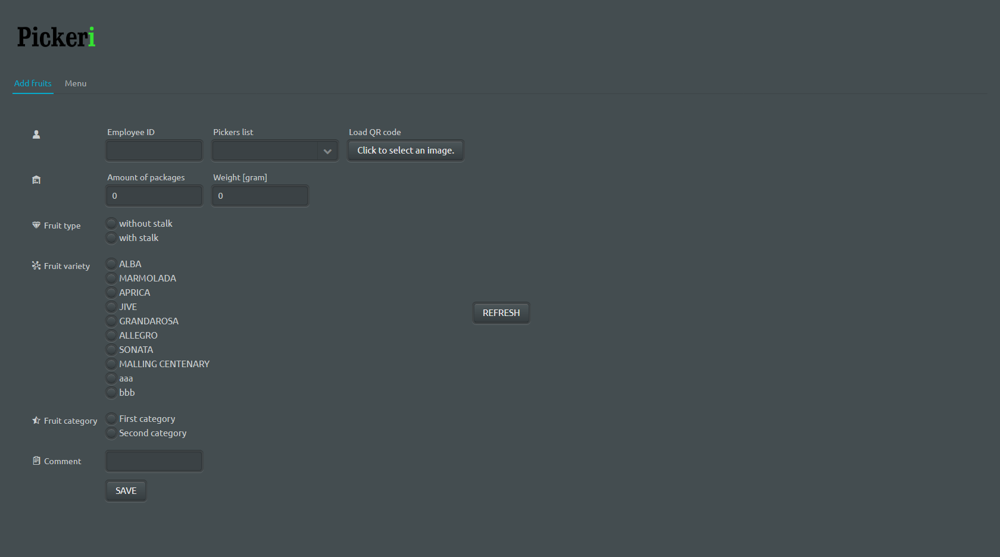
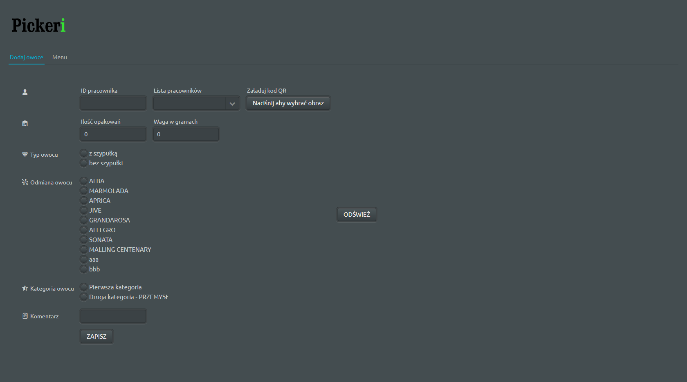
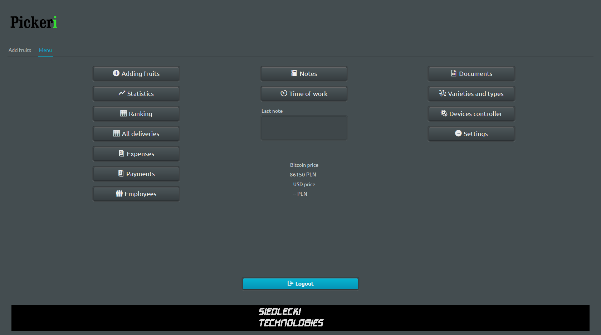

# Pickeri
Project designed for collecting and processing data about fruit pickers. I have designed this for owners of soft fruits plantations, who employ lots of people in a short period of time and often use only paper notebook. Time is money and Pickeri is for saving both. 

This applications is missing a good android mobile app. I hope to have a time for that in the future.

Swagger URL: http://localhost:8082/swagger-ui.html

Login data: user pass

<h3>Technologies used:</h3>

- Java 11
- Spring Boot
- Vaadin 8.7.1
- MySQL

<h3>Visualisation:</h3>
 
English add-delivery:

Polish add-delivery: 

English menu: 

Polish menu: 

